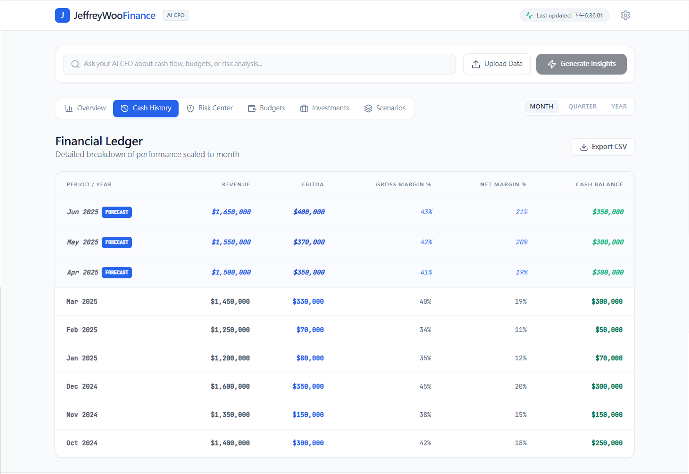
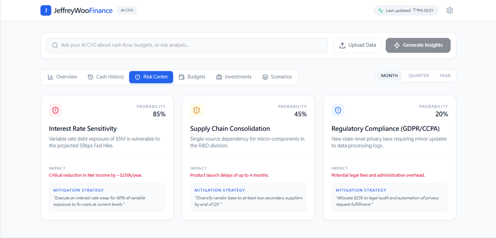
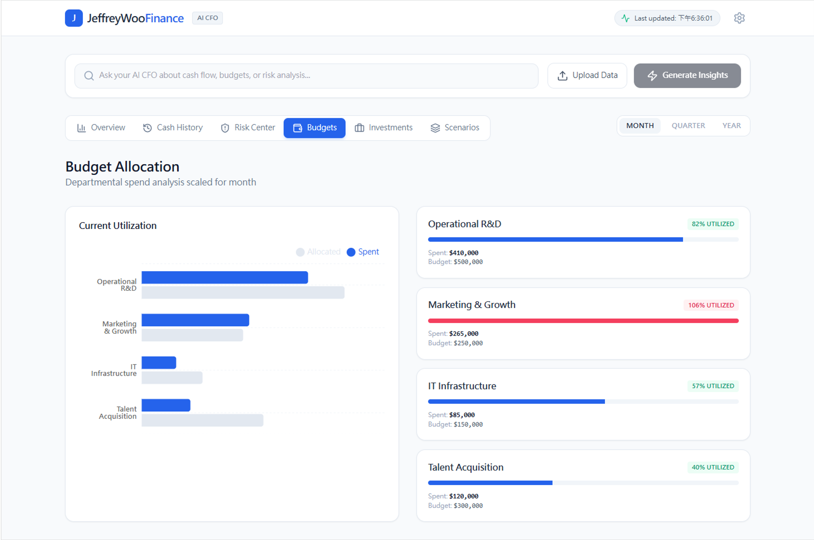
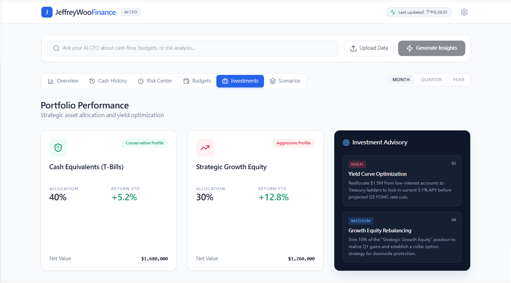

  

Not your typical financial strategic decision assistant app!

JeffreyWooFinance is an AI-powered financial strategic decision assistant designed to help businesses and professionals make smarter, faster, and more confident financial choices.

## ✨ What It Does
- 📊 Real-Time Financial Intelligence — analyze complex financial data and market trends using predictive models
- 🧠 AI-Powered Strategic Guidance — deliver actionable recommendations for investment, budgeting, and risk management
- 🔍 Scenario Simulation Engine — explore “what-if” models to evaluate outcomes before making decisions
- 🌍 Multi-Market Analysis — supports financial insights across APAC, US, and Europe
- 🔒 Enterprise-Grade Security — built with reproducible workflows and scalable architecture

## 🚀 Why Choose JeffreyWooFinance?
Most tools just crunch numbers. JeffreyWooFinance goes further — embedding AI into your decision-making process so you can anticipate risks, seize opportunities, and align financial strategies with long-term goals.

## 📦 Highlights
- Connect your financial datasets by using your uploaded source file
- Run JeffreyWooFinance to generate insights, simulations, and strategic recommendations tailored to your business

Disclaimer: This app provides AI-driven insights for informational purposes only. It does not replace professional financial expert's advice.

# Run and deploy this AI Studio app

This contains everything you need to run this app locally.

View this app in AI Studio: https://ai.studio/apps/drive/1rgYmHYlOgFGrP0dBGZlrefMjgnggC0rA

## Run Locally

**Prerequisites:**  Node.js

1. Install dependencies:
   `npm install`
2. Set the `GEMINI_API_KEY` in [.env.local](.env.local) to your Gemini API key
3. Run the app:
   `npm run dev`

## Sample

