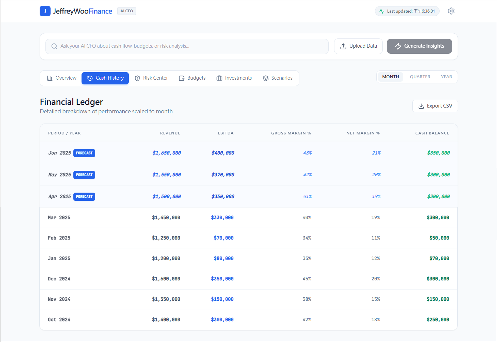
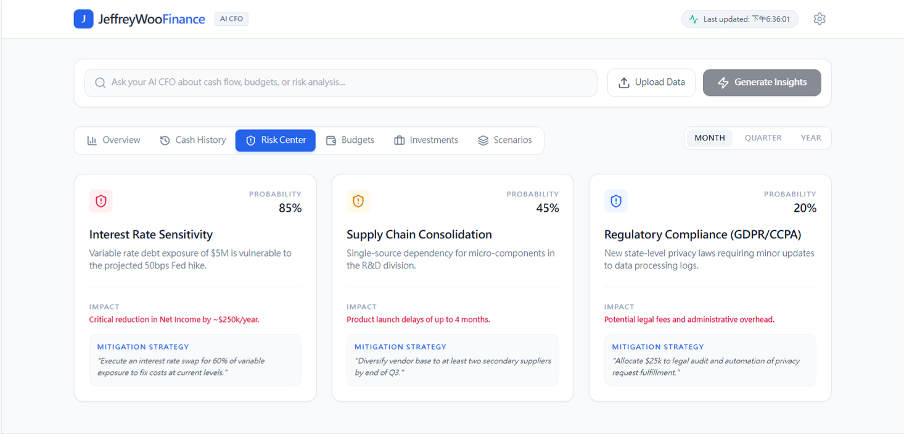
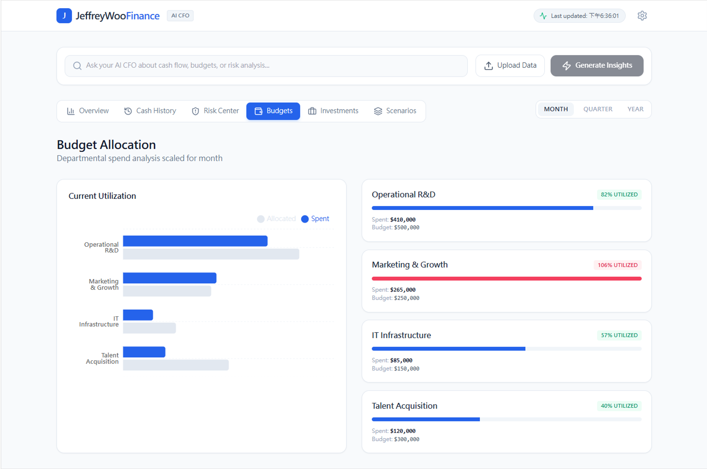
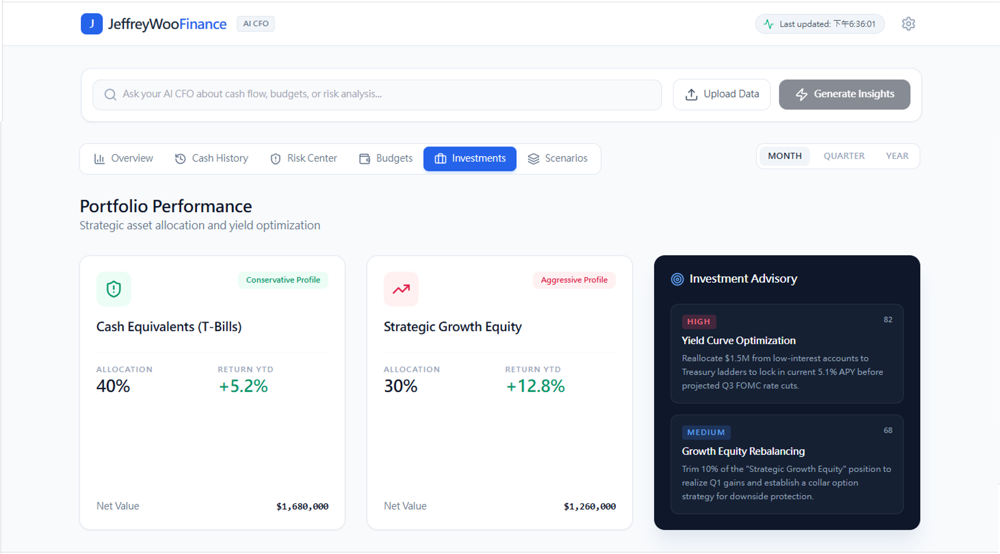
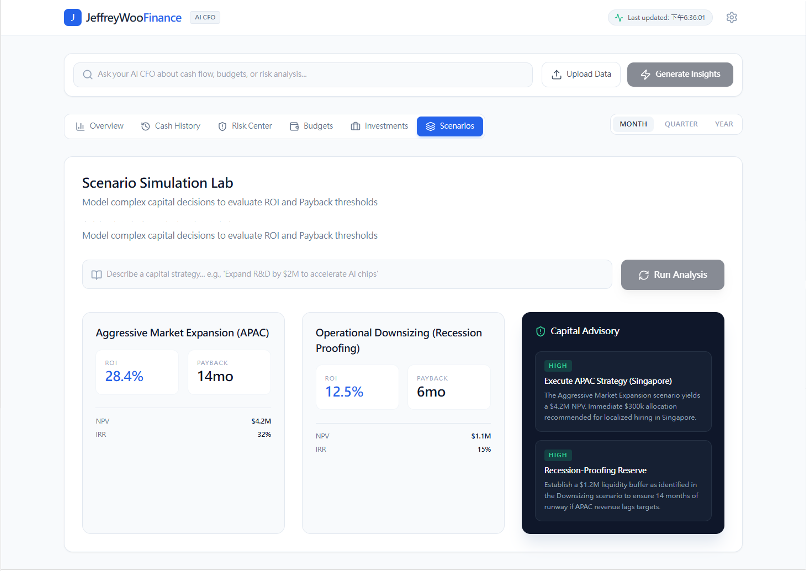

  

## 📊 Overview

Not your typical financial strategic decision assistant app!

**JeffreyWooFinance** is an AI-powered financial strategic decision assistant designed to help businesses and professionals make smarter, faster, and more confident financial choices.

## ✨ What It Does
- 📊 **Real-Time Financial Intelligence** — analyze complex financial data and market trends (by month/quarter/year) using predictive models
- 🧠 **AI-Powered Strategic Guidance** — deliver actionable recommendations for investment, budgeting, and risk management
- 🔍 **Scenario Simulation Engine** — explore “what-if” models to evaluate outcomes before making decisions
- 🌍 **Multi-Market Analysis** — supports financial insights across APAC, US, and Europe
- 🔒 **Enterprise-Grade Security** — built with reproducible workflows and scalable architecture

## 🚀 Why Choose JeffreyWooFinance
Most tools just crunch numbers. **JeffreyWooFinance** goes further — embedding AI into your decision-making process so you can anticipate risks, seize opportunities, and align financial strategies with long-term goals.

## 🤖 Tech Stack
- **Language** — TypeScript, HTML  
- **Framework** — React (with Vite as the build tool)  
- **UI** — Standard React components, styled via TSX
- **Runtime** — Node.js

## 💰 Financial Theories Applied
This app leverages accounting and finance principles to automate analysis of corporate performance, investment decisions, and compliance reporting. It transforms raw financial data into actionable insights for managers, auditors, and investors:
- **Financial Statement Analysis** — The app parses balance sheets, income statements, and cash flow statements, applying ratio analysis (e.g. EBITDA margin, net profit margin) to benchmark company performance.  
- **DuPont Framework** — Embedded into dashboards to decompose Return on Equity (ROE) into margin, turnover, and leverage, helping users identify drivers of shareholder value.  
- **Discounted Cash Flow (DCF), Net Present Value (NPV) & Internal Rate of Return (IRR)** - Used in scenario simulations to evaluate investment projects and long-term corporate valuation, directly integrated into the app’s forecasting module.  
- **Capital Asset Pricing Model (CAPM)** — Applied to estimate cost of equity and Weighted Average Cost of Capital (WACC), supporting financing decisions within the app’s risk-return analysis.  
- **Variance & Sensitivity Analysis** — AI-driven stochastic simulations test resilience of financial outcomes under different market conditions, aligning with actuarial-style stress testing.  
- **Cash Flow Statement Interpretation** — Automated classification of operating, investing, and financing cash flows to highlight liquidity risks and sustainability.  
- **Consolidation & Group Structures** — The app models intercompany transactions and compliance with controlled foreign corporation (CFC) regimes, ensuring accurate group-level reporting.

## 💡Finance Transformation Impact
This project showcases how technology can reshape financial management by:  
- Digitizing strategic finance workflows with predictive modeling & real‑time insights.  
- Enhancing executive decision‑making through scenario simulations & ROI/payback analysis.  
- Optimizing liquidity & risk management with automated forecasting tools.  
- Driving enterprise transformation by aligning financial strategies with long‑term organizational goals.  
- Promoting responsible innovation with secure handling of sensitive financial data.

## ⭐ Finance Skills Strengthened
- Full‑stack architecture for finance applications.  
- Secure handling of financial data & environment variables.  
- AI model integration into real‑world financial analysis workflows.  
- Parsing & transforming ERP & structured datasets for insights.  
- Interactive dashboards & state management in React (TypeScript + Vite).

## 📦 Getting Started
1. Connect your financial datasets by uploading your source file
2. Run **JeffreyWooFinance** to generate insights, simulations, and strategic recommendations tailored to your business

## ⚖️ Disclaimer
**JeffreyWooFinance** provides AI-driven insights for informational purposes only. It does not replace professional financial expert's advice.

## ⚙️ Run Locally

**Prerequisites:**  Node.js

1. Install dependencies:
   `npm install`
2. Set the `GEMINI_API_KEY` in [.env.local](.env.local) file after you create .env.local file
3. Run the app:
   `npm run dev`

## 📋 Sample

