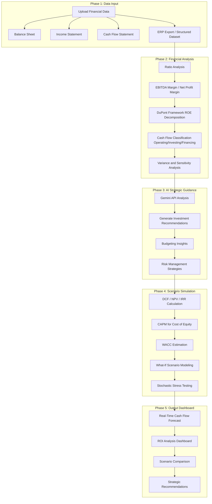

  

## 📊 Overview

> **Not your typical financial strategic decision assistant app!**

**JeffreyWooFinance** is an AI-powered financial strategic decision assistant designed to help businesses and professionals make smarter, faster, and more confident financial choices.

## ✨ What It Does
- 📊 **Real-Time Financial Intelligence** — analyze complex financial data and market trends (by month/quarter/year) using predictive models
- 🧠 **AI-Powered Strategic Guidance** — deliver actionable recommendations for investment, budgeting, and risk management
- 🔍 **Scenario Simulation Engine** — explore “what-if” models to evaluate outcomes before making decisions
- 🌍 **Multi-Market Analysis** — supports financial insights across APAC, US, and Europe
- 🔒 **Enterprise-Grade Security** — built with reproducible workflows and scalable architecture

## 💡Finance Transformation Impact
This project showcases how technology can reshape financial management by:  
- Digitizing strategic finance workflows with predictive modeling & real‑time insights.  
- Enhancing executive decision‑making through scenario simulations & ROI/payback analysis.  
- Optimizing liquidity & risk management with automated forecasting tools.  
- Driving enterprise transformation by aligning financial strategies with long‑term organizational goals.  
- Promoting responsible innovation with secure handling of sensitive financial data.

## 🚀 Why Choose JeffreyWooFinance
Most tools just crunch numbers. **JeffreyWooFinance** goes further — embedding AI into your decision-making process so you can anticipate risks, seize opportunities, and align financial strategies with long-term goals.

## 💰 Financial Theories Applied
This app leverages accounting and finance principles to automate analysis of corporate performance, investment decisions, and compliance reporting. It transforms raw financial data into actionable insights for managers, auditors, and investors:
- **Financial Statement Analysis** — The app parses balance sheets, income statements, and cash flow statements, applying ratio analysis (e.g. EBITDA margin, net profit margin) to benchmark company performance.  
- **DuPont Framework** — Embedded into dashboards to decompose Return on Equity (ROE) into margin, turnover, and leverage, helping users identify drivers of shareholder value. 
- **Discounted Cash Flow (DCF), Net Present Value (NPV) & Internal Rate of Return (IRR)** - Used in scenario simulations to evaluate investment projects and long-term corporate valuation, directly integrated into the app’s forecasting module.  
- **Capital Asset Pricing Model (CAPM)** — Applied to estimate cost of equity and Weighted Average Cost of Capital (WACC), supporting financing decisions within the app’s risk-return analysis.  
- **Variance & Sensitivity Analysis** — AI-driven stochastic simulations test resilience of financial outcomes under different market conditions, aligning with actuarial-style stress testing.  
- **Cash Flow Statement Interpretation** — Automated classification of operating, investing, and financing cash flows to highlight liquidity risks and sustainability.  
- **Consolidation & Group Structures** — The app models intercompany transactions and compliance with controlled foreign corporation (CFC) regimes, ensuring accurate group-level reporting.

## 📐Data Flow and Logic Sequence

The following diagram illustrates how the system transforms raw financial data into strategic recommendations — from data input through ratio analysis, DuPont decomposition, AI-powered Gemini API insights, scenario simulation (DCF/NPV/IRR/CAPM/WACC), and finally the output dashboard — applying the financial theories described above at each stage.

> **How to read this diagram:** The flow follows 5 phases:
> 1. **Data Input** — Upload financial statements
> 2. **Financial Analysis** — Ratios, DuPont, cash flow classification
> 3. **AI Strategic Guidance** — Gemini API recommendations
> 4. **Scenario Simulation** — DCF/NPV/IRR, CAPM, WACC, stress testing
> 5. **Output Dashboard** — Forecasts, ROI analysis, recommendations

```mermaid
flowchart TD
    subgraph PHASE1["Phase 1: Data Input"]
        direction TB
        A1["Upload Financial Data"] --> A2["Balance Sheet"]
        A1 --> A3["Income Statement"]
        A1 --> A4["Cash Flow Statement"]
        A1 --> A5["ERP Export / Structured Dataset"]
    end

    subgraph PHASE2["Phase 2: Financial Analysis"]
        direction TB
        B1["Ratio Analysis"] --> B2["EBITDA Margin / Net Profit Margin"]
        B2 --> B3["DuPont Framework ROE Decomposition"]
        B3 --> B4["Cash Flow Classification Operating/Investing/Financing"]
        B4 --> B5["Variance and Sensitivity Analysis"]
    end

    subgraph PHASE3["Phase 3: AI Strategic Guidance"]
        direction TB
        C1["Gemini API Analysis"] --> C2["Generate Investment Recommendations"]
        C2 --> C3["Budgeting Insights"]
        C3 --> C4["Risk Management Strategies"]
    end

    subgraph PHASE4["Phase 4: Scenario Simulation"]
        direction TB
        D1["DCF / NPV / IRR Calculation"] --> D2["CAPM for Cost of Equity"]
        D2 --> D3["WACC Estimation"]
        D3 --> D4["What-If Scenario Modeling"]
        D4 --> D5["Stochastic Stress Testing"]
    end

    subgraph PHASE5["Phase 5: Output Dashboard"]
        direction TB
        E1["Real-Time Cash Flow Forecast"] --> E2["ROI Analysis Dashboard"]
        E2 --> E3["Scenario Comparison"]
        E3 --> E4["Strategic Recommendations"]
    end

    A5 --> B1
    B5 --> C1
    C4 --> D1
    D5 --> E1
```

## ⭐ Finance Skills Strengthened
- Full‑stack architecture for finance applications.  
- Secure handling of financial data & environment variables.  
- AI model integration into real‑world financial analysis workflows.  
- Parsing & transforming ERP & structured datasets for insights.  
- Interactive dashboards & state management in React (TypeScript + Vite).

## 🤖 Tech Stack
- **Language** — TypeScript, HTML  
- **Framework** — React (with Vite as the build tool)  
- **UI** — Standard React components, styled via TSX
- **Runtime** — Node.js

## 📦 Getting Started
1. Connect your financial datasets by uploading your source file
2. Run **JeffreyWooFinance** to generate insights, simulations, and strategic recommendations tailored to your business

## ⚙️ Run Locally

**Prerequisites:**  Node.js

1. Install dependencies:
   `npm install`
2. Set the `GEMINI_API_KEY` in [.env.local](.env.local) file after you create .env.local file
3. Run the app:
   `npm run dev`

## 📋 Sample

## 📚 References

**1. Financial Theories & Models**

**Financial Statement Analysis & Ratio Analysis (Parses balance sheets, income statements, and cash flow statements; applies ratio analysis (EBITDA margin, net profit margin) to benchmark company performance)**

- [Subramanyam, K. R. (2009). Financial Statement Analysis (11th ed.). McGraw-Hill Education.](https://digilib.stekom.ac.id/assets/dokumen/ebook/feb_df9f8cf5ea0e415255756a5140ce3269cdd020c6_1724921857.pdf)

**DuPont Framework (Embedded into dashboards to decompose Return on Equity (ROE) into margin, turnover, and leverage, helping users identify drivers of shareholder value)**

- [Foulke, R. A. (1968). Practical Financial Statement Analysis (6th ed.). McGraw-Hill. (Original work published 1945)](https://www.amazon.com/Practical-Financial-Statement-Analysism-6th/dp/007021655X)

**Discounted Cash Flow (DCF), Net Present Value (NPV) & Internal Rate of Return (IRR) (Used in scenario simulations to evaluate investment projects and long-term corporate valuation, directly integrated into the app's forecasting module)**

- [Brealey, R. A., Myers, S. C., & Allen, F. (2023). Principles of Corporate Finance (14th ed.). McGraw-Hill Education. (Original work published 1981)](https://www.mheducation.com/highered/product/principles-of-corporate-finance-brealey.html?viewOption=student)

**Capital Asset Pricing Model (CAPM) & Weighted Average Cost of Capital (WACC) (Applied to estimate cost of equity and WACC, supporting financing decisions within the app's risk-return analysis)**

- [Sharpe, W. F. (1964). Capital asset prices: A theory of market equilibrium under conditions of risk. The Journal of Finance, 19(3), 425–442.](https://www.sfu.ca/~kkasa/Sharpe_64.pdf)
- [Lintner, J. (1965). The valuation of risk assets and the selection of risky investments in stock portfolios and capital budgets. The Review of Economics and Statistics, 47(1), 13–37.](https://www.aea.ru/data/pdf/lintner1965.pdf)
- [Modigliani, F., & Miller, M. H. (1958). The Cost of Capital, Corporation Finance and the Theory of Investment. The American Economic Review, 48(3), 261–297.](https://www.jstor.org/stable/1809766)

**Variance & Sensitivity Analysis (AI-driven stochastic simulations test resilience of financial outcomes under different market conditions, aligning with actuarial-style stress testing)**

- [Saltelli, A., Ratto, M., Andres, T., Campolongo, F., Cariboni, J., Gatelli, D., Saisana, M., & Tarantola, S. (2008). Global Sensitivity Analysis: The Primer. John Wiley & Sons.](https://www.andreasaltelli.eu/file/repository/A_Saltelli_Marco_Ratto_Terry_Andres_Francesca_Campolongo_Jessica_Cariboni_Debora_Gatelli_Michaela_Saisana_Stefano_Tarantola_Global_Sensitivity_Analysis_The_Primer_Wiley_Interscience_2008_.pdf)

**Cash Flow Statement Interpretation (Automated classification of operating, investing, and financing cash flows to highlight liquidity risks and sustainability)**

- [Quinn, M., & Strauss, E. (Eds.). (2018). Cash flow analysis. In The Routledge Companion to Financial Accounting Theory. Routledge.](https://www.scribd.com/document/659682947/The-Routledge-Companion-to-Accounting-Information-Systems-Quinn-Martin-Strauss-Erik-Z-Library)

**Consolidation & Group Structures (Models intercompany transactions and compliance with controlled foreign corporation (CFC) regimes, ensuring accurate group-level reporting)**

- [OECD. (2015). Designing Effective Controlled Foreign Company (CFC) Rules. OECD Publishing.](https://www.oecd.org/tax/beps/designing-effective-controlled-foreign-company-rules-9789264241152-en.htm)

**2. Technology Stack**

**Gemini API (Generates investment recommendations, budgeting insights, and risk management strategies)**

- [Gemini Team, Google. Gemini API.](https://ai.google.dev/gemini-api/docs)

**React (with Vite) & TypeScript (Interactive dashboards for real-time cash flow forecasting, ROI analysis, scenario comparison, and strategic recommendations)**

- [Biasi, B. Vite: Next Generation Frontend Tooling.](https://vite.dev/)
- [Facebook Open Source. React: The Library for Web and Native User Interfaces.](https://github.com/facebook/react)

**Node.js (Backend runtime environment for the application)**

- [Node.js Foundation. Node.js® JavaScript Runtime.](https://nodejs.org/)

**3. Regulatory & Compliance Frameworks**

**Controlled Foreign Company (CFC) Rules (Ensures accurate group-level reporting and compliance with international tax frameworks)**

- [Organisation for Economic Co-operation and Development (OECD). (2015). Base Erosion and Profit Shifting (BEPS) Action 3: Designing Effective Controlled Foreign Company (CFC) Rules. OECD Publishing.](https://www.oecd.org/tax/beps/beps-action-3-designing-effective-controlled-foreign-company-rules.pdf)

## ⚖️ Disclaimer
**JeffreyWooFinance** provides AI-driven insights for informational, educational, and demonstration purposes only. It does not constitute professional financial, investment, or legal advice.

AI‑generated predictions, analyses, and recommendations are based on historical data and machine learning models. They are not guarantees of future performance and may contain errors or omissions.

Always consult a qualified financial professional before making any investment or business decisions. The developer assumes no liability for any losses or damages arising from the use of this app.

Use at your own risk.

## 📄 License

**GNU Affero General Public License v3.0 (AGPL‑3.0)** — JeffreyWooFinance 

- ✅ You are free to use, modify, and distribute this software, provided that any derivative works are also licensed under AGPL‑3.0.
- ✅ If you run or deploy this software over a network (e.g., as a web service), you must make the source code of your modified version available to all users who interact with it.
- ✅ This ensures transparency, collaboration, and continued open‑source availability of improvements.
- ❌ The software is provided “as is”, without warranties of any kind.

For full details, see the [LICENSE](./LICENSE) file.

## 👤 About the Author
Jeffrey Woo — Finance Manager | Strategic FP&A, AI Automation & Cost Optimization | MBA | FCCA | CTA | FTIHK | SAP Financial Accounting (FI) Certified Application Associate | Xero Advisor Certified

📧 Email: jeffreywoocf@gmail.com  
💼 LinkedIn: https://www.linkedin.com/in/wcfjeffrey/  
🐙 GitHub: https://github.com/wcfjeffrey/
